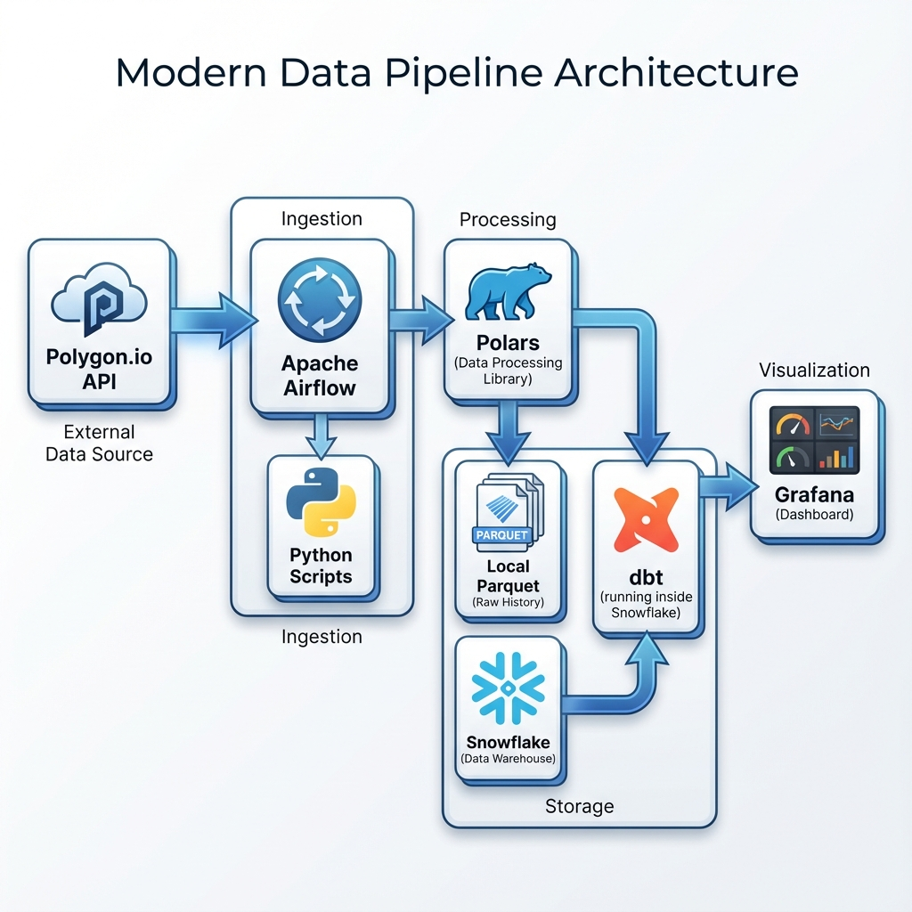

# 📈 Stock API Pipeline


## 📋 Overview

The **Stock API Pipeline** is a robust End-to-End (E2E) data engineering project designed to fetch, process, store, and visualize stock market dividend data. 

It leverages **Polygon.io** as the primary data source, orchestrates workflows using **Apache Airflow** (via Astronomer), performs high-performance data processing with **Polars**, stores data in **Snowflake**, transforms it using **dbt**, and visualizes insights on **Grafana** dashboards.

## 🏗️ Architecture



The pipeline follows a modern ELT (Extract, Load, Transform) architecture:

1.  **Extract**: Python scripts fetch real-time dividend data from the **Polygon.io API**.
2.  **Process**: Data is normalized and cleaned using **Polars** for high performance.
3.  **Load**:
    *   **Raw History**: Appended to a local Parquet file (`Data/dividends_data.parquet`) for a persistent raw history.
    *   **Staging**: New data is written to CSV and loaded into **Snowflake** (`POLYGON.DIVIDENDS`).
4.  **Transform**: **dbt** models run transformations within Snowflake to prepare data for analytics.
5.  **Visualize**: **Grafana** connects to Snowflake to display real-time dashboards.

## 📂 Project Structure

```bash
stock-api-pipeline/
├── astro_airflow/          # Main Airflow project (Astronomer)
│   ├── dags/               # Airflow DAGs
│   │   └── stock_data_dag.py
│   ├── include/            # Helper scripts and resources
│   │   └── Scripts/        # ETL logic (fetch_data.py, etc.)
│   ├── stock_dbt/          # dbt project for transformations
│   └── Dockerfile          # Airflow runtime configuration
├── scripts/                # Standalone Python scripts
├── Data/                   # Local data storage (Parquet/CSV)
├── Dashboards from grafana/# Dashboard screenshots
├── Logs in airflow/        # Execution logs and screenshots
└── README.md               # Project documentation
```

## 🚀 Features

*   **Automated Ingestion**: Scheduled every 5 minutes to fetch the latest dividend data.
*   **Hybrid Storage**: Maintains both a local Parquet archive and a cloud-based Snowflake data warehouse.
*   **Data Quality**: Schema validation and type casting using Polars before loading.
*   **Idempotency**: Handles data appending and overwriting gracefully to prevent duplicates.
*   **Monitoring**: Integrated logging and Airflow UI for pipeline monitoring.

## 🛠️ Prerequisites

Before running the project, ensure you have the following:

*   **Docker Desktop** (running)
*   **Astronomer CLI** (`astro`)
*   **Python 3.9+**
*   **Snowflake Account**
*   **Polygon.io API Key**

## ⚙️ Installation & Setup

1.  **Clone the Repository**
    ```bash
    git clone https://github.com/yourusername/stock-api-pipeline.git
    cd stock-api-pipeline
    ```

2.  **Configure Environment Variables**
    Create a `.env` file in the `astro_airflow` directory with your credentials:
    ```env
    SNOWFLAKE_USER=your_user
    SNOWFLAKE_PASSWORD=your_password
    SNOWFLAKE_ACCOUNT=your_account
    SNOWFLAKE_WAREHOUSE=your_warehouse
    SNOWFLAKE_DATABASE=your_database
    SNOWFLAKE_SCHEMA=your_schema
    POLYGON_API_KEY=your_api_key
    ```

3.  **Start Airflow**
    Navigate to the `astro_airflow` directory and start the local Airflow environment:
    ```bash
    cd astro_airflow
    astro dev start
    ```
    *   **Airflow UI**: http://localhost:8080
    *   **User/Pass**: admin / admin

4.  **Run dbt (Optional Manual Run)**
    You can trigger dbt manually if needed:
    ```bash
    cd astro_airflow/stock_dbt
    dbt run
    ```

## 📉 Monitoring & Logs

The pipeline execution is monitored via the Airflow UI. Below are examples of successful DAG runs and task logs.

### Python ETL Execution


### dbt Transformation


## 📊 Dashboards

The project includes Grafana dashboards to visualize dividend trends, payouts, and ticker performance.

### Overview Dashboard


### Detailed Metrics


## 🔄 Workflow

The **`stock_data_dag`** runs on a 5-minute schedule:
1.  **`main_script_for_ETL`**: Executes the Python ETL script to fetch data from Polygon and load it into Snowflake.
2.  **`transform_data_using_dbt`**: Triggers dbt models to transform the loaded data.

---
*Built with ❤️ by Data Expert Labs*
